## 1. Problems of LASSO in High-Dimensional Data Settings

**AI Contribution**
AI helped me summarize the theoretical shortcomings of LASSO under p ≫ n, including shrinkage bias, instability under correlated predictors and let me know what innovation I need to make.

## 2. Why SCAD as a Solution

**AI Contribution**
AI explained the intuition behind nonconvex penalties, derived the piecewise SCAD derivative, compared SCAD to MCP and adaptive LASSO, and clarified why SCAD achieves lower bias and better variable selection in high-correlation environments.
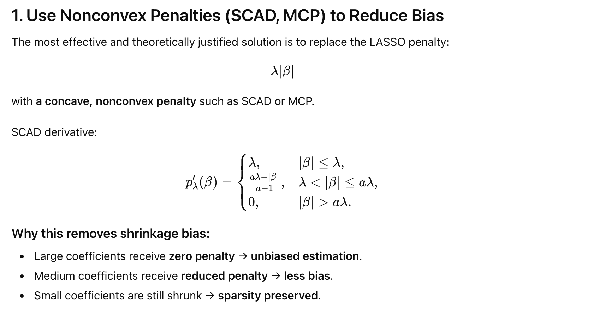

## 3. Why Local Quadratic Approximation (LQA)

**AI Contribution**
AI helped me derive how LQA transforms a nonconvex penalty into a sequence of solvable ridge-type problems, explained the iterative reweighted scheme, and provided the exact weight-update formula used for SCAD.
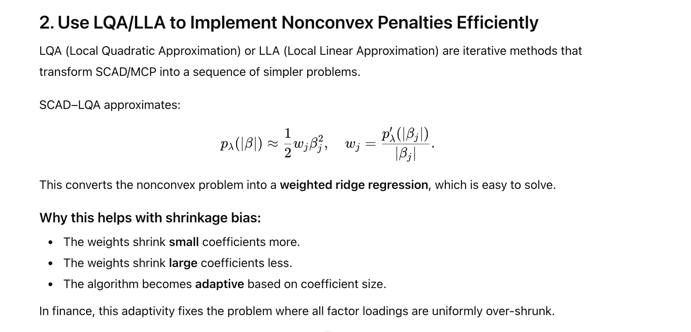

## 4. Experimental Design for Static SCAD Models

**ChatGPT Contribution**
ChatGPT assisted in designing the experiment by suggesting that the settings (n = 100, p = 50) and (n = 100, p = 100) provide a realistic moderately high-dimensional regime where LASSO's shrinkage bias is clearly observable while the models remain statistically stable. It also recommended using correlated predictors and sparse true coefficients to create a fair and informative comparison between LASSO and SCAD-LQA. This AI-guided setup highlights SCAD's advantage in reducing bias under practical high-dimensional conditions.

## Cursor Contribution
Claude contributed by helping me implement the full simulation pipeline and model-comparison code for the LASSO and SCAD-LQA experiments. It assisted in writing clean and reproducible R/Python scripts for data generation, coefficient initialization, SCAD weight updates, and iterative LQA optimization.

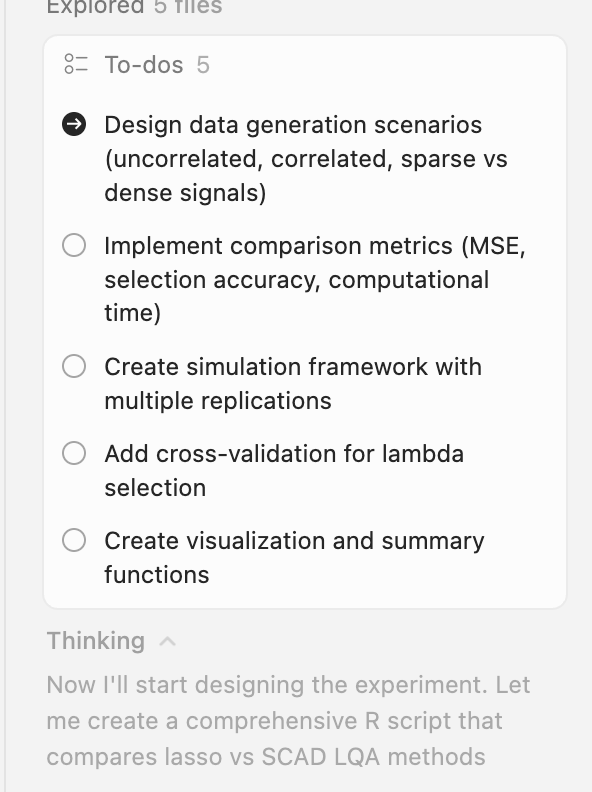

## 5. Problems of Classical LQA

**AI Contribution**
After I provided the initial experimental results to Cursor, it helped me interpret the performance gaps between LASSO and SCAD-LQA and identify the sources of numerical instability in the LQA implementation and suggested concrete improvements including adaptive ridge stabilization, SVD/QR-based solvers, hard-thresholding of small updates, and more robust initialization strategies.

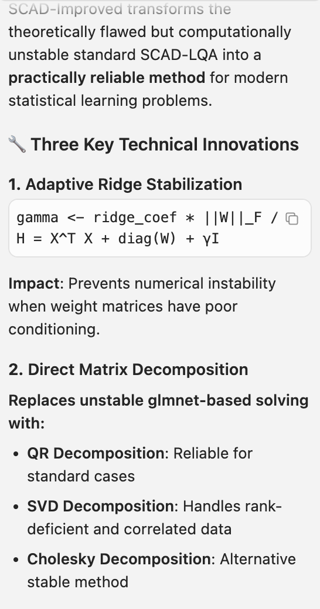

## 6. Why Dynamic SCAD for Time-Varying Factor Loadings

**AI Contribution**
AI played a central role in developing the Dynamic SCAD framework. It helped me understand why static penalties fail under time-varying factor structures and clarified how temporal smoothness and structural-break detection can be unified through SCAD and total-variation penalties. AI also guided the choice between ADMM, LLA, and LQA for dynamic estimation, explained how to derive block-tridiagonal updates, and identified stable parameterizations that avoid divergence.

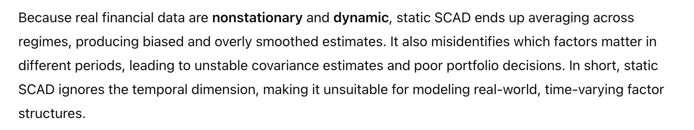

## 7. How to Formulate a Dynamic SCAD Model

**AI Contribution**
AI guided me in constructing the dynamic model:
βj,t − βj,t−1 with SCAD/total-variation penalties, derived the augmented objective function, suggested auxiliary-variable parameterization, and clarified connections to trend filtering.

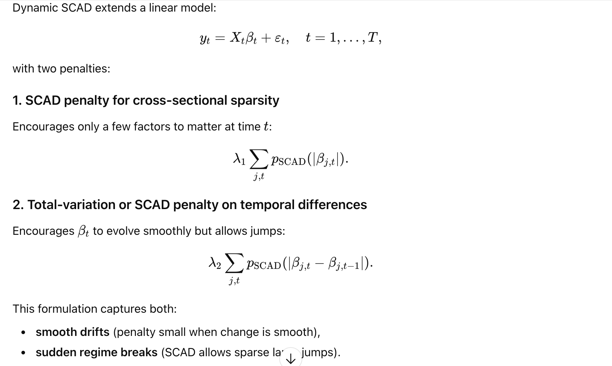

## 8. How to Estimate the Dynamic SCAD Model

**AI Contribution**
AI helped derive the ADMM/LLA/LQA variants for dynamic SCAD, constructed block-tridiagonal system updates, explained proximal operators for temporal penalties, and produced implementable pseudocode for my solver.

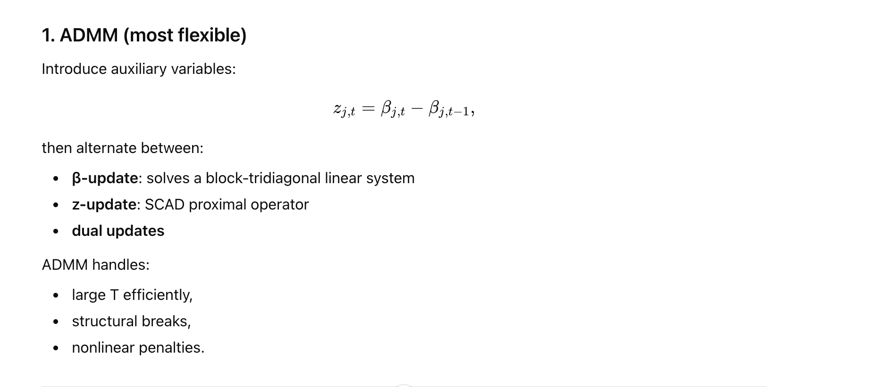

## 9. Experimental Design for Dynamic SCAD

**AI Contribution**
AI assisted in designing temporal simulations (regime shifts, smooth drifts, sparse breaks), evaluating recovery accuracy, designing metrics for temporal stability, and preparing the code for dynamic model experiments.

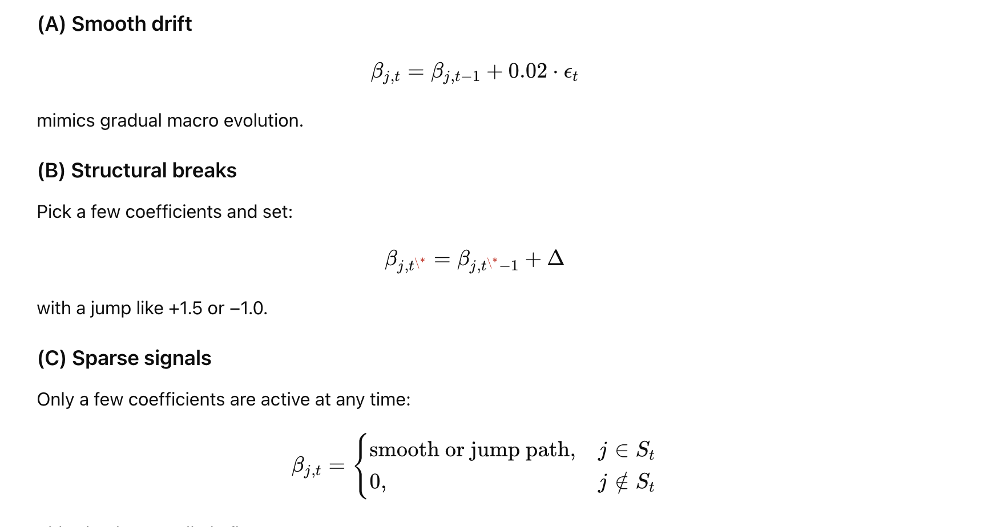

## AI Contribution
Same as static Claude contributed by helping me implement the full simulation pipeline and model-comparison code for dynamic SCAD. It assisted in writing clean and reproducible R/Python scripts for data generation, coefficient initialization, SCAD weight updates, and iterative LQA optimization.

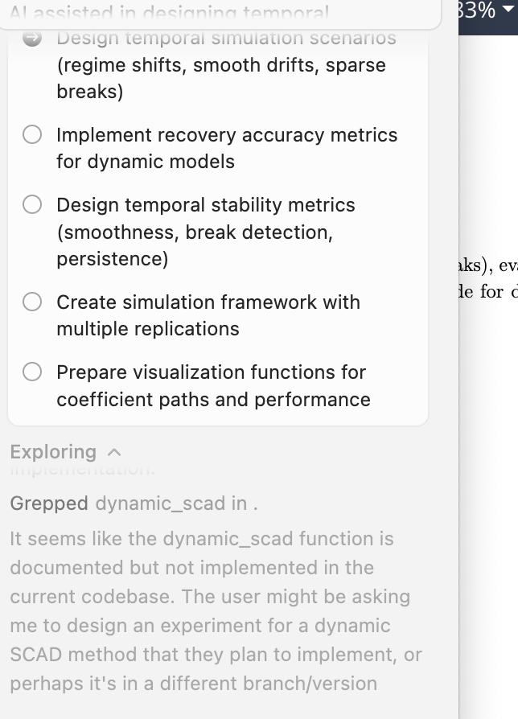

## 10. Real Data for both static and dynamic Scad

**How AI Helps in This Setting**
AI played an important role in designing and executing the real-data analysis for both static and Dynamic SCAD. It assisted me in identifying financial datasets where factor loadings are known to evolve over time—such as Fama-French factors, industry portfolios, and ETF return panels—and explained why these datasets are appropriate for evaluating temporal regularization. AI also guided the construction of rolling windows, scaling procedures, and alignment of predictors with returns to ensure that the dynamic model receives clean and properly structured inputs.

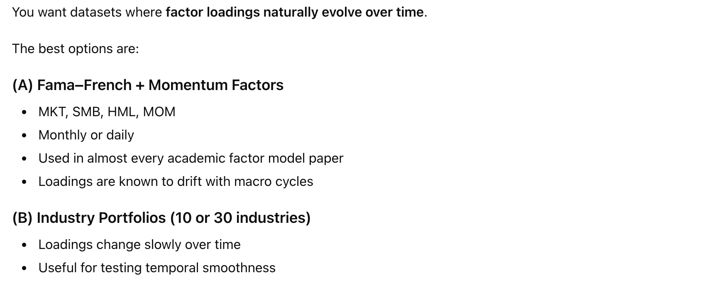

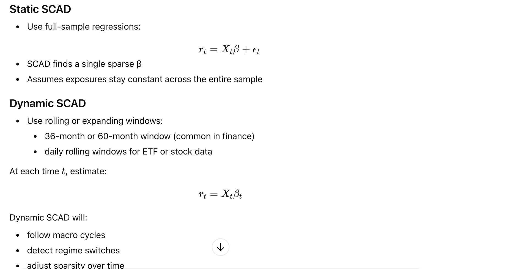

